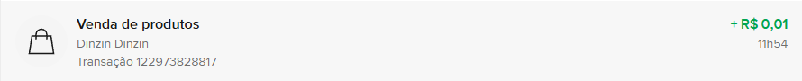
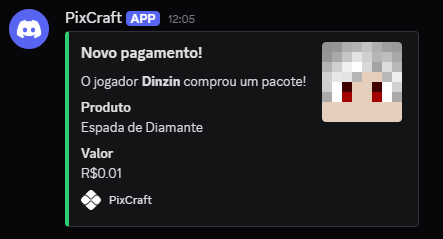

# 💰 PixCraft  

[]() []() [](LICENSE)

Transforme seu servidor Minecraft em um negócio!  **PixCraft** permite que seus 
jogadores comprem itens direto no jogo usando **QR Code** do **MercadoPago**. 
Simples, seguro e em tempo real com notificações no **Discord**.

---

## 🚀 Funcionalidades principais  

- ✅ Integração completa com o **MercadoPago**  
- ✅ Pagamento via **QR Code** diretamente no jogo  
- ✅ **GUI** para confirmação de pedidos  
- ✅ Integração com **webhook no Discord** para notificação de novos pagamentos  
- ✅ Loja com interface de **baú**  
- ✅ Nome do comando para abrir a loja **personalizável**  
- ✅ Suporte a itens com **Custom Model Data** e integração com **ItemsAdder** nas ícones da GUI  

---

## 🧩 Ícones com ItemsAdder e Custom Model Data

Nos arquivos de menu/produto (`icon`), agora você pode usar:

- `material: itemsadder:namespace:item_id` (ou `material: ia:namespace:item_id`) para carregar um item do ItemsAdder.
- `custom-model-data: <numero>` para aplicar o Custom Model Data em versões compatíveis.

Exemplo:

```yml
icon:
  material: itemsadder:my_pack:ruby_sword
  custom-model-data: 1010
  displayname: "&c&lEspada Ruby"
  lore:
    - "&7Exemplo de item customizado"
  amount: 1
  enchanted: false
```

---

## 📦 Comandos e Permissões  

| Comando     | Descrição                   | Permissão        |
|-------------|-----------------------------|------------------|
| `/pixcraft` | Comando principal do plugin | `pixcraft.command` |
| `/loja`     | Abre a loja do plugin       | `pixcraft.shop`  |

### Subcomandos  

| Comando     | Subcomando | Descrição          |Permissão               |
|-------------|------------|--------------------|------------------------|
| `/pixcraft` | `reload`   | Recarrega o plugin |`pixcraft.command.reload`|
| `/pixcraft` | `menu`     | Abre um menu       |`pixcraft.command.menu` |
| `/pixcraft` | `product`  | Compra um produto  |`pixcraft.command.product`|

---

## ⚙️ Instalação  

1. Baixe a última versão do plugin em [realeses](https://github.com/Dinz1n/PixCraft/releases).  
2. Coloque o arquivo `.jar` na pasta `plugins` do seu servidor.  
3. Reinicie o servidor.  
4. Configure as credenciais do **MercadoPago** no arquivo `config.yml`.  

---

## 📷 Demonstração  
### Pagamento de um produto de teste.

### A atualização no mercadopago é quase imediata.

### Mas a notificação no discord pode levar alguns segundos.


---

## 🤝 Contribuindo  

Contribuições são sempre bem-vindas!  

1. Faça um fork do repositório  
2. Crie uma branch para sua feature ou correção (`git checkout -b minha-feature`)  
3. Commit suas alterações (`git commit -m 'Minha nova feature'`)  
4. Envie sua branch (`git push origin minha-feature`)  
5. Abra um Pull Request 🚀  

---

## 📜 Licença  

Este projeto está sob a licença **AGPL 3.0** – veja o arquivo [LICENSE](LICENSE) para mais detalhes.  
